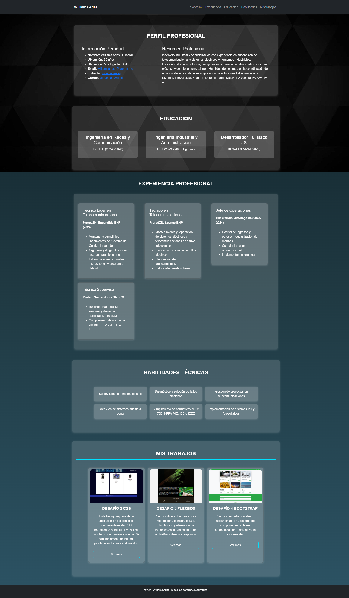

# 📌 Prueba 1 - Williams Arias

Portafolio web desarrollado por **Williams Arias** para presentar su perfil profesional, experiencia, habilidades y proyectos. Implementado con **HTML, CSS y Bootstrap**.

## 📸 Capturas de Pantalla



## 🚀 Características

- **Diseño Responsive:** Adaptado para escritorio, tablet y móvil.
- **Fondo Animado:** Se implementó un video de fondo en formato `.webm`.
- **Secciones Dinámicas:** Navegación fluida con Bootstrap y efectos CSS.
- **Portfolio Interactivo:** Tarjetas de proyectos con imágenes y enlaces.

## 🛠️ Tecnologías Utilizadas

- **HTML**: Estructura semántica.
- **CSS & Bootstrap 5**: Estilos y diseño responsive.
- **JavaScript (Opcional)**: Funcionalidades interactivas adicionales.
- **GitHub Pages**: Despliegue en la web.

## 🔄 Forks Realizados

Forks en los siguientes proyectos y contribuciones:

| Usuario | Proyecto | Último Commit Enviado |
|---------|---------|----------------------|
| [vfaundez](https://github.com/vfaundez) | [vfaundez-dev.github.io](https://github.com/vfaundez/vfaundez-dev.github.io) | "implementacion de CSS" |
| [DiegoAPA52](https://github.com/DiegoAPA52) | [DiegoAPA52.github.io](https://github.com/DiegoAPA52/DiegoAPA52.github.io) | "Implementación de efecto neon en títulos y botones" |

## 👅 Instalación y Uso

1. **Clonar el repositorio:**
   ```bash
   git clone https://github.com/wiimri/devportfolio.git
   ```

2. **Abrir el proyecto en Visual Studio Code (VSC):**
   ```bash
   cd devportfolio
   code .
   ```

3. **Ejecutar en el navegador:**
   - Abre `index.html` en tu navegador.

## 🌎 Despliegue en GitHub Pages

Si deseas publicar tu portafolio en GitHub Pages:

1. Ir a **Settings > Pages** en tu repositorio.
2. Seleccionar la rama `main` y la carpeta `/ (root)`.
3. Guardar cambios y esperar unos minutos.
4. Tu portafolio estará disponible en:
   ```
   https://wiimri.github.io/devportfolio/
   ```

## 📝 Autor

**Williams Arias**  
📌 [LinkedIn](https://www.linkedin.com/in/williamsariasq) | 📂 [GitHub](https://github.com/wiimri)

📧 Contacto: [williams.arias.q@gmail.com](mailto:williams.arias.q@gmail.com)

